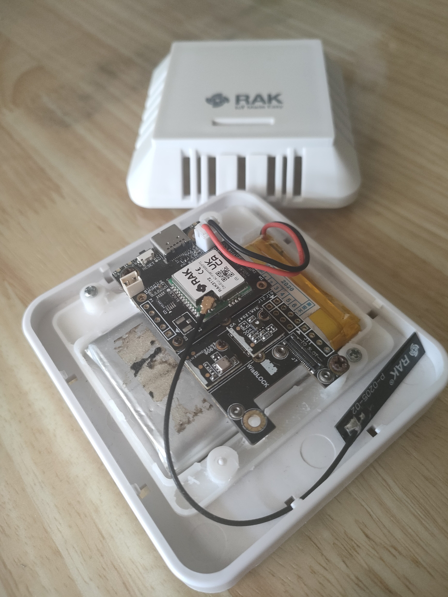
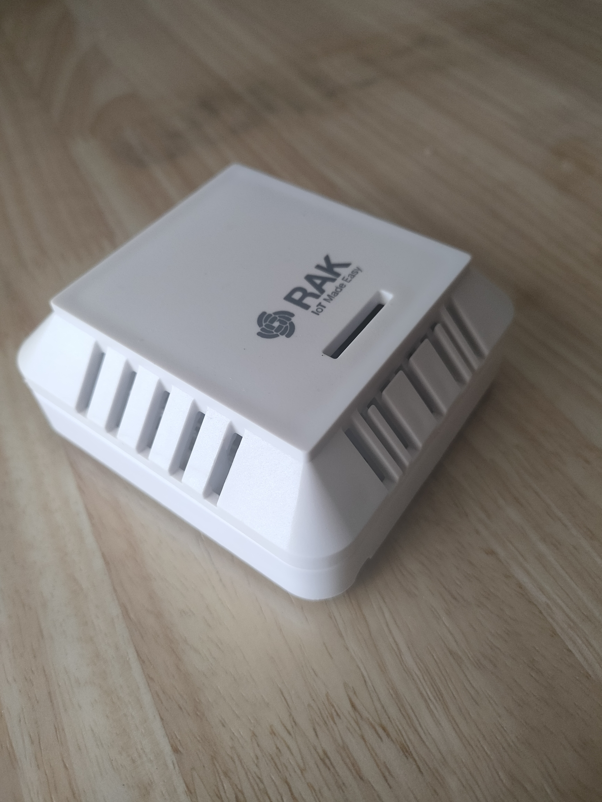
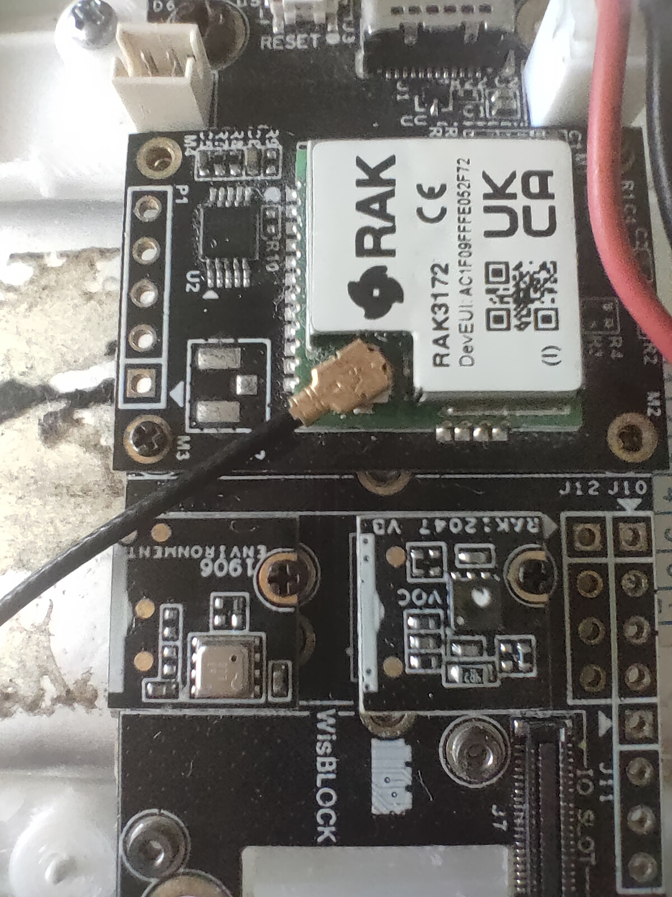
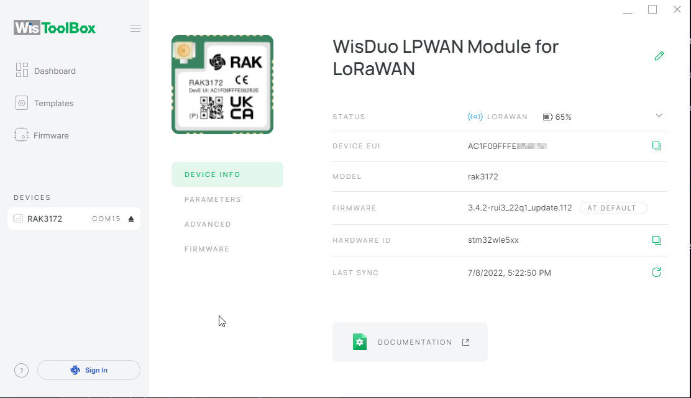
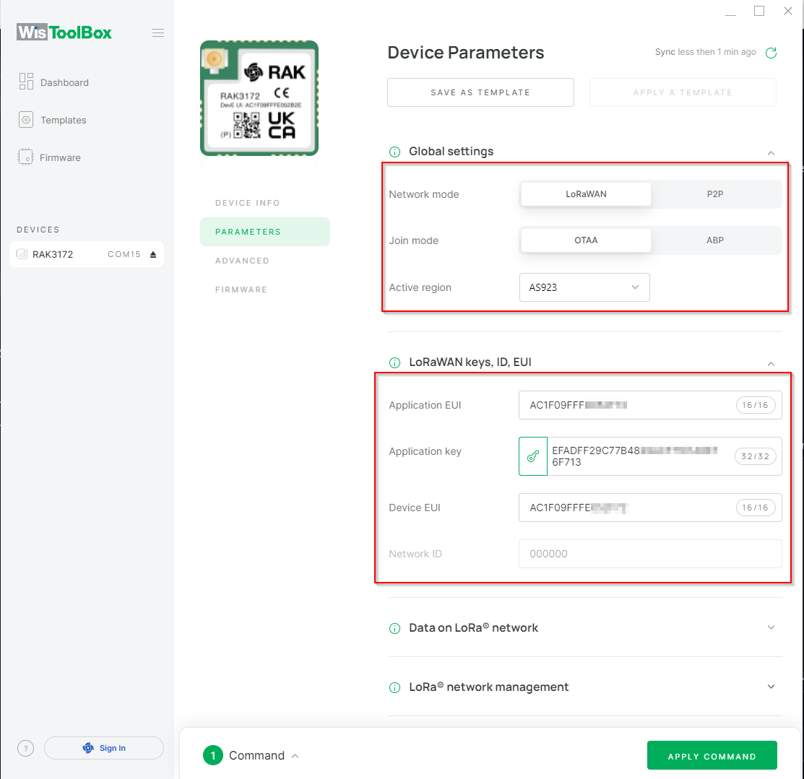
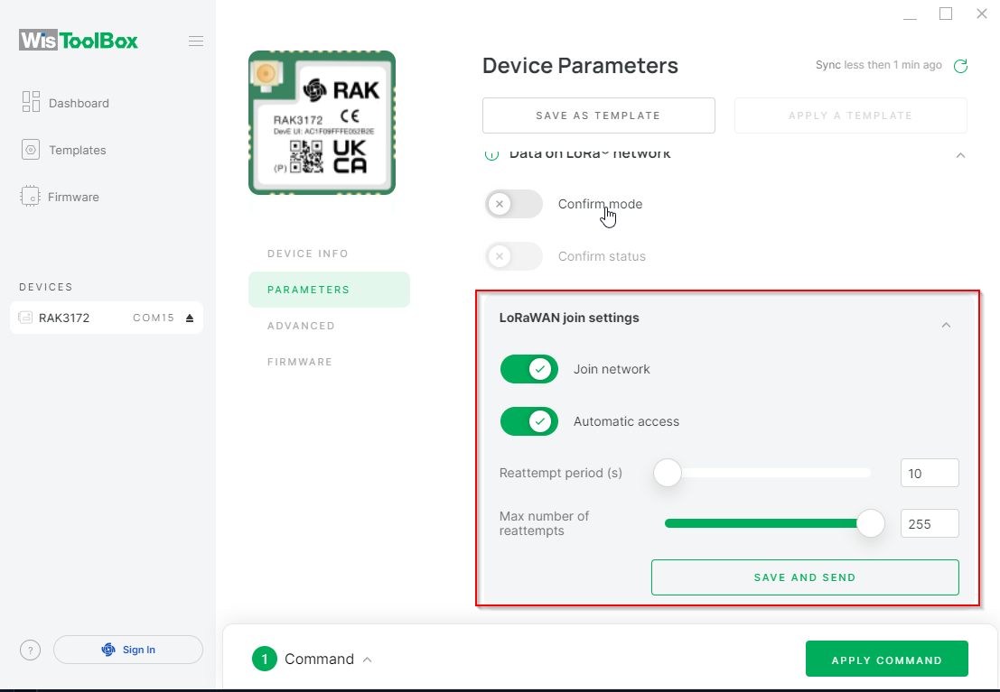
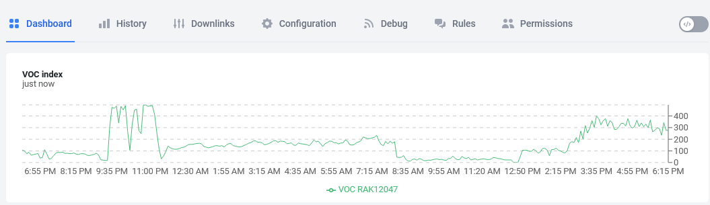
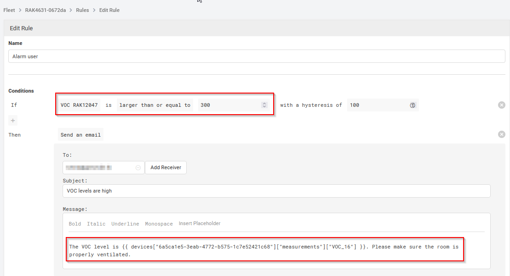

# RUI3-RAK12047-Air-Quality
RUI3 example code for the WisBlock Air Quality Sensor RAK12047.

A healthy environment is important for our wellbeing. That includes the air around you.
Do you know if the air around you is good or if it is time to open a window and get some fresh air in?

One option to measure the quality of the air is to measure the volatile organic compounds concentration (VOC). With the measured values of the Sensirion SGP40 and the Sensirion SHTC3, Sensirion VOC algorithm calculates the VOC index from 0 to 500. 
With the new WisBlock RAK12047 VOC sensor it is easy to build a sensor system for your house or office that measures the VOC index of the air. Based on the Sensirion SGP40 and using the Sensirion Gas Index Algorithm, it is just a Click!  Code!  Connect! to build an air quality sensor.

The code compiles on both RAK4631-R and RAK3172 and I test it on both modules.

# Content
- [Hardware supported](#hardware-supported)
- [Software used](#software-used)
- [Packet data format](#packet-data-format)
- [Device setup](#device-setup)
- [Data visualization and creating an alarm](#data-visualization-and-creating-an-alarm)

----

# Hardware supported
| Module | Function | Supported |
| --     | --       | --          |
| [RAK4631-R](https://docs.rakwireless.com/Product-Categories/WisBlock/RAK4631-R/Overview/) ⤴️ | WisBlock Core module with RUI3| ✔ |
| [RAK3372](https://docs.rakwireless.com/Product-Categories/WisDuo/RAK3172-Evaluation-Board/Overview) ⤴️ | WisDuo RAK3172 Evaluation Board with RUI3| ✔ |
| [RAK5005-O](https://docs.rakwireless.com/Product-Categories/WisBlock/RAK5005-O/Overview/) ⤴️ | WisBlock Base board | ✔ |
| [RAK19003](https://docs.rakwireless.com/Product-Categories/WisBlock/RAK19003/Overview/) ⤴️ | WisBlock Mini Base board | ✔ |
| [RAK19001](https://docs.rakwireless.com/Product-Categories/WisBlock/RAK19001/Overview/) ⤴️ | WisBlock Fullsize Base board | ✔ |
| [RAK1901](https://docs.rakwireless.com/Product-Categories/WisBlock/RAK1901/Overview/) ⤴️ | WisBlock Temperature and Humidity Sensor | ✔ |
| [_alternative_ RAK1906](https://docs.rakwireless.com/Product-Categories/WisBlock/RAK1906/Overview/) ⤴️ | WisBlock Environment Sensor | ✔ |
| [RAK12047](https://docs.rakwireless.com/Product-Categories/WisBlock/RAK12047/Overview/) ⤴️ | WisBlock VOC sensor | ✔ |

----

# Software used
## IDE
- [Visual Studio Code](https://code.visualstudio.com/) ⤴️
- [Arduino Extension for VSC](https://marketplace.visualstudio.com/items?itemName=vsciot-vscode.vscode-arduino) ⤴️
- [_alternative_ ArduinoIDE](https://www.arduino.cc/en/software) ⤴️
- [RAK-STM32-RUI](https://github.com/RAKWireless/RAKwireless-Arduino-BSP-Index) ⤴️
- [RAK-nRF52-RUI](https://github.com/RAKWireless/RAKwireless-Arduino-BSP-Index) ⤴️
## LoRaWAN payload creation
- [CayenneLPP](https://registry.platformio.org/libraries/sabas1080/CayenneLPP) ⤴️
- [ArduinoJson](https://registry.platformio.org/libraries/bblanchon/ArduinoJson) ⤴️
## Sensor libraries
- [RUI3 RAK1901 library](https://registry.platformio.org/libraries/RAKwireless/RAKwireless_RAK1901_Temperature_and_Humidity_SHTC3)
- [Adafruit BME680 Library](https://registry.platformio.org/libraries/adafruit/Adafruit%20BME680%20Library) ⤴️
- [Adafruit Unified Sensor](https://registry.platformio.org/libraries/adafruit/Adafruit%20Unified%20Sensor) ⤴️
- [Sensirion Core](https://registry.platformio.org/libraries/sensirion/Sensirion%20Core) ⤴️
- [Sensirion Gas Index Algorithm](https://registry.platformio.org/libraries/sensirion/Sensirion%20Gas%20Index%20Algorithm) ⤴️
- [Sensirion I2C SGP40](https://registry.platformio.org/libraries/sensirion/Sensirion%20I2C%20SGP40) ⤴️
## Device setup
- [WisToolBox](https://docs.rakwireless.com/Product-Categories/Software-Tools/WisToolBox/Overview) ⤴️

----

# Packet data format
The packet data is made compatible with the extended Cayenne LPP encoding from [ElectronicCats/CayenneLPP](https://github.com/ElectronicCats/CayenneLPP) ⤴️.    
The content of the packet depends on the modules installed on the WisBlock Base Board:     

| Data                     | Channel # | Channel ID | Length   | Comment                                           | Required Module   | Decoded Field Name |
| --                       | --        | --         | --       | --                                                | --                | --                 |
| Battery value            | 1         | _**116**_  | 2 bytes  | 0.01 V Unsigned MSB                               | RAK4631           | voltage_1          |
| Humidity                 | 2         | 104        | 1 bytes  | in %RH                                            | RAK1901           | humidity_2         |
| Temperature              | 3         | 103        | 2 bytes  | in °C                                             | RAK1901           | temperature_3      | 
| Humidity 2               | 6         | 104        | 1 bytes  | in %RH                                            | RAK1906           | humidity_6         |
| Temperature 2            | 7         | 103        | 2 bytes  | in °C                                             | RAK1906           | temperature_7      | 
| Barometric Pressure 2    | 8         | 115        | 2 bytes  | in hPa (mBar)                                     | RAK1906           | barometer_8        |
| Gas Resistance 2         | 9         | 2          | 2 bytes  | 0.01 signed (kOhm)                                | RAK1906           | analog_9           |
| VOC                      | 16        | _**138**_  | 2 bytes  | VOC index                                         | RAK12047          | voc_16             |

### _REMARK_
Channel ID's in cursive are extended format and not supported by standard Cayenne LPP data decoders.

Example decoders for TTN, Chirpstack, Helium and Datacake can be found in the folder [decoders](./decoders) ⤴️

# Product images
|  |  |
| -- | -- |
|  |  |

# Device setup
After the WisBlock Air Quality Sensor is flashed with the firmware, it needs to be registered on a LoRaWAN server to be able to send the measured data. Tutorials how to setup a LoRaWAN node on a LoRaWAN server can be found in the [RAKwireless Documentation Center](https://docs.rakwireless.com/Product-Categories/WisDuo/RAK3172-Module/Quickstart/#rak3172-as-a-lora-lorawan-modem-via-at-command).    

After the device is registered on a LoRaWAN server it can be setup and activated with AT commands through the USB connection with a Serial Terminal application or with the [RAKwireless WisToolBox](https://docs.rakwireless.com/Product-Categories/Software-Tools/WisToolBox/Overview/).

Connect to the device with WisToolBox

Goto Parameters section and setup the LoRaWAN connection mode, and the LoRaWAN keys, ID and EUI 

Then select how the device should connect to the LoRaWAN server. I suggest to set it activate _**Automatic access**_. If this is choosen, the device will automatically join the network after a reboot or power up.

# Data visualization and creating an alarm

As we can receive the data in the LoRaWAN server, we need to create an integration to a visualization tool. I prefer [Datacake](https://datacake.co/), it is very easy to setup and it is as well easy to create reactions on events by either sending a text message, email or create a downlink message to another LoRaWAN device. That could be used for example to control fans or air conditioners to start refreshing the air in the room with the bad air quality condition.

After setting up the device in Datacake and creating the Dashboard the VOC index can be visualized:

And using the Datacake rules we can create an email warning about the bad air quality:

This will send out an email with the VOC level and an advice:

